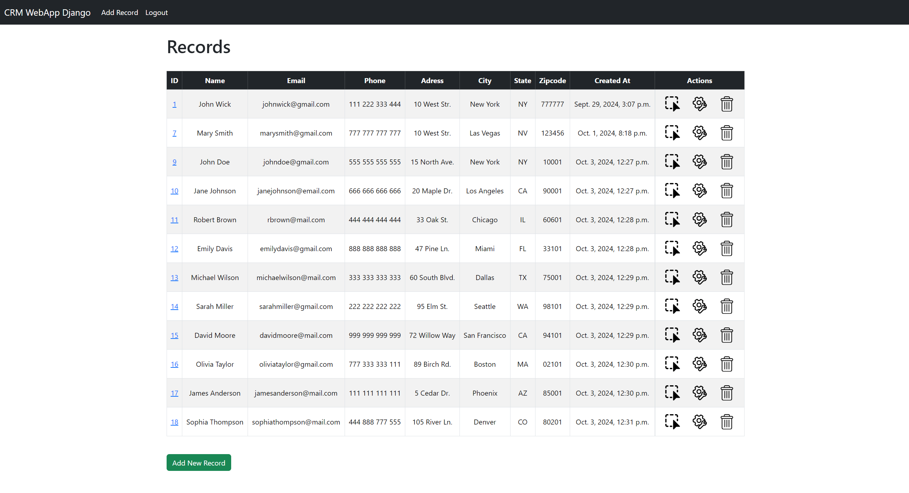
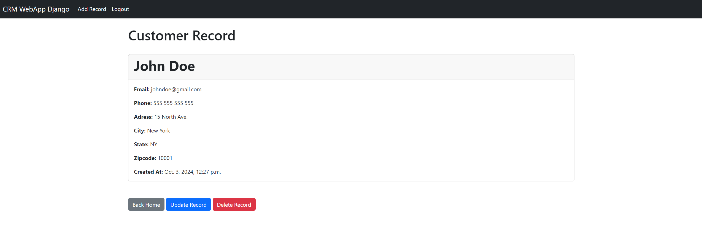
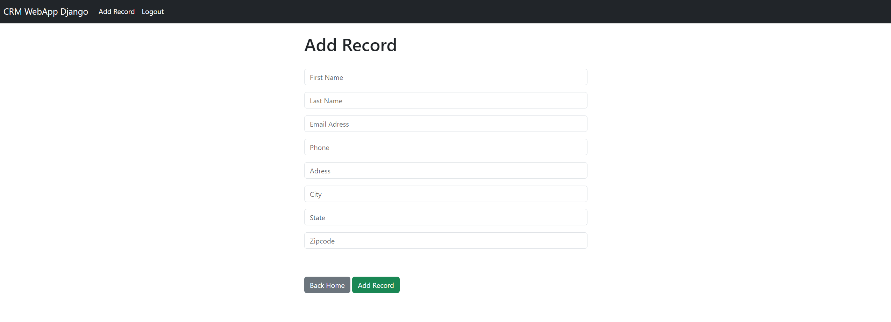

# Django CRM Web Application

This is a **Customer Relationship Management (CRM)** web application built with **Django** (Python) and **MySQL** as the database. The app allows users to register, log in, and manage customer records with full **CRUD** (Create, Read, Update, Delete) functionality.

## Features

- **User Authentication**: Users can register, log in, and log out securely.
- **Customer Records**: Perform CRUD operations on customer records. Each record includes:
  - First Name
  - Last Name
  - Email
  - Phone Number
  - Address
  - City
  - State
  - Zip Code
- **MySQL Database**: All data is stored in a MySQL database.
- **Responsive UI**: The app is designed with a user-friendly interface for easy navigation and record management.

## Screenshots 

*Home - See All Records*

*Individual Record*

*Adding New Record*